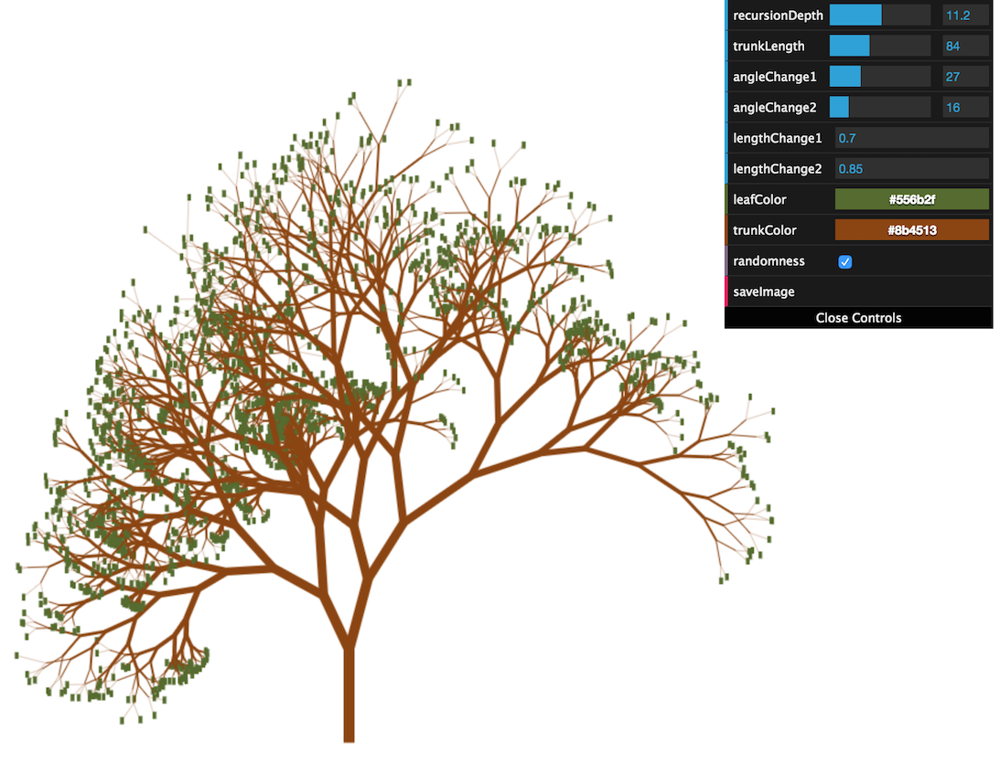

# Fractal Tree 2D

Simple 2D Fractal Tree generator implemented in JavaScript.

Try it live by clicking on the image above!

# Usage

Load the page and adjust the settings values in the control panel.  The tree will regenerate for each value change.

Select 'saveImage' to take a snapshot of the current tree and display it in another browser page.  Manually save the image from that page.

# Implementation

Written in JavaScript with a touch of html/css for wrapping the drawing context.

Uses the [dat.GUI](http://workshop.chromeexperiments.com/examples/gui/) library for the control panel.
